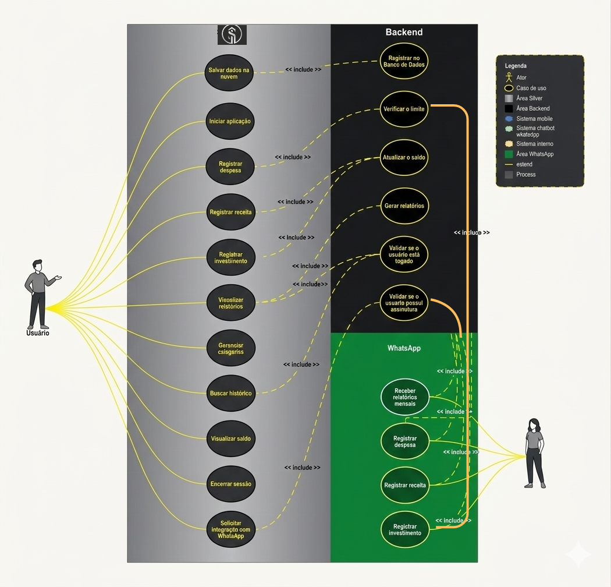

# Especificações do Projeto

Pré-requisitos: <a href="1-Documentação de Contexto.md"> Documentação de Contexto</a>

Este capítulo detalha as especificações do projeto **Silver** a partir da perspectiva do usuário. A definição do problema e a concepção da solução são aprofundadas por meio da criação de personas, histórias de usuário, requisitos funcionais e não funcionais, além das restrições e da arquitetura distribuída que nortearão o desenvolvimento.

## Personas

Para compreender as necessidades, dores e objetivos dos usuários, foram desenvolvidas três personas baseadas no público alvo identificado. Elas representam perfis distintos que se beneficiarão da solução proposta.

| Foto | Perfil | Detalhes | Motivações e Comportamento |
| :--- | :--- | :--- | :--- |
|  | **Nome:** Maria da Silva **Idade:** 38 anos **Profissão:** Auxiliar Administrativa | **Renda:** R$ 2.400,00 **Tecnologia:** Familiarizada com WhatsApp e utiliza celular Android. | **Dores:** Esquece de anotar pequenos gastos e acha planilhas complicadas. **Objetivos:** Usar o WhatsApp para registros instantâneos e ver relatórios simples no celular. |

| [!](https://github.com/ICEI-PUC-Minas-PMV-ADS/pmv-ads-2026-1-e4-proj-infra-t3-silver/blob/main/docs/02-Especificação%20do%20Projeto.md#:~:text=68747470733a2f2f692e70726176617461722e63632f3135303f753d616c6578.jpeg) | **Nome:** João Pereira **Idade:** 24 anos **Profissão:** Vendedor Autônomo | **Renda:** R$ 1.800,00 **Tecnologia:** Usuário ativo de aplicativos e redes sociais. | **Dores:** Dificuldade em separar gastos pessoais de profissionais no dia a dia. **Objetivos:** Registrar tudo rápido pelo WhatsApp e usar o Dashboard Web para planejamento mensal. |
|  | **Nome:** Carlos Santos **Idade:** 32 anos **Profissão:** Técnico de TI | **Renda:** R$ 4.500,00 **Tecnologia:** Confortável com Dashboards complexos e múltiplas janelas. | **Dores:** Precisa de uma visão analítica potente para gerir investimentos e metas. **Objetivos:** Usar o Dashboard Web para análises profundas e integração total entre dispositivos. |

## Histórias de Usuários

Com base na análise das personas foram identificadas as seguintes histórias de usuários:

|EU COMO... `PERSONA`| QUERO/PRECISO ... `FUNCIONALIDADE` |PARA ... `MOTIVO/VALOR` |
|--------------------|------------------------------------|----------------------------------------|
|Maria da Silva | Registrar uma despesa enviando um valor pelo WhatsApp | Não esquecer o gasto logo após a compra. |
|João Pereira | Visualizar meu Dashboard Web consolidado | Analisar meus lucros e despesas do mês em uma tela grande. |
|Carlos Santos | Definir metas de economia para o final do ano | Acompanhar meu progresso de forma automática. |
|João Pereira | Receber um resumo diário via WhatsApp | Ter consciência do quanto ainda posso gastar no dia. |
|Maria da Silva | Categorizar minhas contas por cor e ícone | Facilitar a identificação visual dos meus gastos no app. |

## Requisitos

As tabelas a seguir apresentam os requisitos funcionais e não funcionais que detalham o escopo do projeto, distribuídos entre os membros da equipe para desenvolvimento completo (Backend e Frontend).

### Requisitos Funcionais

| ID | Descrição do Requisito | Prioridade | Responsável |
| :--- | :--- | :--- | :--- |
| **RF01** | Permitir o registro de transações (receitas/despesas) via API e WhatsApp. | Alta | Aécio |
| **RF02** | Fornecer um Dashboard Web principal para visualização de saldo e extrato. | Alta | Adrian |
| **RF03** | Permitir a sincronização em tempo real entre Web e Mobile. | Alta | Nathan |
| **RF04** | Permitir a criação, edição e exclusão de categorias financeiras. | Média | Victor |
| **RF05** | Realizar o cálculo e exibição de saldo consolidado de múltiplas contas. | Alta | Vinícius |
| **RF06** | Permitir o cadastro de metas financeiras com acompanhamento de progresso. | Média | Yago |
| **RF07** | Gerenciar autenticação (Login/Registro) e perfil de usuário. | Alta | Aécio |
| **RF08** | Possibilitar a exportação de relatórios em PDF/CSV no Dashboard Web. | Baixa | Adrian |
| **RF09** | Disparar alertas ou resumos diários de orçamento via WhatsApp. | Média | Nathan |
| **RF10** | Permitir a anexação de comprovantes (imagens/recibos) nas transações. | Baixa | Victor |
| **RF11** | Permitir a criação de orçamentos mensais com limites de gastos. | Alta | Vinícius |
| **RF12** | Manter e exibir um histórico filtrável de movimentações financeiras. | Média | Yago |

### Requisitos Não Funcionais

| ID | Descrição do Requisito | Prioridade |
| :--- | :--- | :--- |
| **RNF01** | O backend da aplicação deve ser desenvolvido utilizando o framework Laravel (PHP). | Alta |
| **RNF02** | O Dashboard Web deve ser responsivo e otimizado para navegadores modernos. | Alta |
| **RNF03** | O sistema deve adotar uma arquitetura distribuída (API REST) para integração multiplataforma. | Média |
| **RNF04** | Todas as comunicações contendo dados sensíveis devem trafegar via HTTPS. | Alta |
| **RNF05** | O tempo de processamento padrão da API não deve exceder 3 segundos. | Alta |
| **RNF06** | O banco de dados relacional deve garantir integridade e atomicidade das transações. | Alta |

## Matriz de Rastreabilidade

A matriz de rastreabilidade de requisitos é utilizada para garantir que cada requisito do sistema esteja vinculado a um objetivo de negócio (história de usuário) e a um componente de projeto (caso de uso/módulo).

| Requisito | História de Usuário | Caso de Uso / Módulo |
| :--- | :--- | :--- |
| **RF01** | Maria / João - Registrar transação | UC01 - Registrar Transação (WhatsApp/Web) |
| **RF02** | João / Carlos - Visualizar Dashboard | UC02 - Visualizar Painel Financeiro |
| **RF03** | Carlos - Sincronização de Dispositivos | Módulo de Sincronização de Dados |
| **RF04** | Maria - Categorizar Contas | UC03 - Gerenciar Categorias |
| **RF05** | João - Saldo Consolidado | Módulo de Cálculo Financeiro |
| **RF06** | Carlos - Metas de Economia | UC04 - Gerenciar Metas |
| **RF07** | Geral - Autenticação | UC05 - Autenticar Usuário |
| **RF08** | Adrian - Exportar Relatórios | UC06 - Gerar Relatórios |
| **RF09** | Nathan - Alertas WhatsApp | Módulo de Notificações |
| **RF10** | Victor - Anexar Comprovantes | UC07 - Upload de Documentos |
| **RF11** | Vinícius - Orçamentos Mensais | UC08 - Gerenciar Orçamentos |
| **RF12** | Yago - Histórico Filtrável | UC09 - Consultar Histórico |

## Restrições

O projeto está restrito pelas condições apresentadas na tabela a seguir:

|ID| Restrição |
|--|-------------------------------------------------------|
|01| O projeto deve ser entregue até o final das 16 semanas letivas do semestre. |
|02| A infraestrutura deve usar apenas planos gratuitos (*free tiers*), como Render/Azure para backend e Netlify para frontend, além de cotas gratuitas para a API do WhatsApp. |
|03| O desenvolvimento do backend é estritamente obrigatório utilizando Laravel. |

## Arquitetura Distribuída

O **Silver** utiliza uma arquitetura distribuída composta pelos seguintes componentes principais:
1. **API Gateway / Backend (Laravel)**: Núcleo central que processa as regras de negócio, autenticação e comunicação com o banco de dados relacional.
2. **Dashboard Web**: Interface frontend consumindo a API Laravel para análises detalhadas.
3. **WhatsApp Bridge (Node.js/Webhook)**: Microsserviço que processa mensagens enviadas pelo usuário no WhatsApp e as direciona para a API principal criar os registros.
4. **App Mobile**: Aplicativo auxiliar para consultas rápidas na palma da mão.

## Diagrama de Casos de Uso

O diagrama de casos de uso ilustra a fronteira do sistema e o detalhamento das principais interações dos usuários com os serviços distribuídos oferecidos pelo Silver.

## Descrição dos Casos de Uso

A seguir, são detalhados os fluxos principais e exceções dos casos de uso que compõem o sistema Silver.

### UC01 - Registrar Transação (WhatsApp/Web)
- **Ator**: Usuário.
- **Descrição**: Permite o registro de uma nova entrada (receita) ou saída (despesa).
- **Fluxo Básico**: 
    1. O usuário envia o valor e descrição via WhatsApp ou preenche o formulário na Web.
    2. O sistema valida os dados e a categoria.
    3. O sistema confirma o registro e atualiza o saldo.
- **Exceção**: Valor inválido ou falta de conexão com o banco de dados.

### UC02 - Visualizar Painel Financeiro
- **Ator**: Usuário.
- **Descrição**: Exibe o saldo consolidado e gráficos de desempenho financeiro.
- **Fluxo Básico**:
    1. O usuário acessa o Dashboard Web ou a tela principal do App.
    2. O sistema recupera as transações do mês vigente.
    3. O sistema renderiza os gráficos e o saldo atual.

### UC03 - Gerenciar Categorias
- **Ator**: Usuário.
- **Descrição**: Permite personalizar as categorias de gastos (ex: Alimentação, Lazer).
- **Fluxo Básico**:
    1. O usuário acessa a área de configurações de categorias.
    2. O usuário cria, edita ou exclui uma categoria (nome, cor, ícone).
    3. O sistema salva as alterações.

### UC04 - Gerenciar Metas
- **Ator**: Usuário.
- **Descrição**: Define objetivos financeiros de economia.
- **Fluxo Básico**:
    1. O usuário define um valor alvo e uma data limite.
    2. O sistema monitora as economias vinculadas à meta.
    3. O sistema exibe a porcentagem de conclusão.

### UC05 - Autenticar Usuário
- **Ator**: Usuário.
- **Descrição**: Garante o acesso seguro à plataforma.
- **Fluxo Básico**:
    1. O usuário informa e-mail e senha.
    2. O sistema valida as credenciais via API Laravel.
    3. O sistema gera um token de acesso (JWT/Sanctum).

### UC06 - Gerar Relatórios
- **Ator**: Usuário.
- **Descrição**: Exporta dados financeiros para consulta offline.
- **Fluxo Básico**:
    1. O usuário seleciona o período e o formato (PDF/CSV).
    2. O sistema processa os dados e gera o arquivo.
    3. O download é iniciado automaticamente.

### UC07 - Upload de Documentos
- **Ator**: Usuário.
- **Descrição**: Permite anexar fotos de recibos às transações.
- **Fluxo Básico**:
    1. O usuário seleciona uma transação existente.
    2. O usuário faz o upload da imagem do comprovante.
    3. O sistema vincula o arquivo à transação no storage.

### UC08 - Gerenciar Orçamentos
- **Ator**: Usuário.
- **Descrição**: Define limites de gastos por categoria para o mês.
- **Fluxo Básico**:
    1. O usuário define um teto de gastos para uma categoria específica.
    2. O sistema alerta quando o gasto se aproxima do limite.

### UC09 - Consultar Histórico
- **Ator**: Usuário.
- **Descrição**: Permite a busca e filtragem de transações passadas.
- **Fluxo Básico**:
    1. O usuário utiliza filtros (data, categoria, valor).
    2. O sistema exibe a lista de transações correspondentes.

# Gerenciamento de Projeto

## Gerenciamento de Tempo

O desenvolvimento foi estruturado em um cronograma macro de 16 semanas, dividido em quatro ciclos principais (Sprints Mensais):

- **Semanas 1-4 (Mês 1)**: Concepção do projeto, Planejamento da Especificação e Setup do Backend (Laravel).
- **Semanas 5-8 (Mês 2)**: Construção do Dashboard Web e implementação do banco de dados relacional.
- **Semanas 9-12 (Mês 3)**: Desenvolvimento da integração com WhatsApp (Bridge) e rotas de API.
- **Semanas 13-16 (Mês 4)**: Desenvolvimento do App Mobile, testes de sincronização, correções e entrega final.

## Gerenciamento de Custos

O projeto Silver foi concebido para operar majoritariamente sobre infraestruturas de nível gratuito (*Free-Tier*), minimizando o investimento inicial. Neste momento, não estamos prevendo nenhum custo para o desenvolvimento do projeto, visto que será desenvolvido por alunos do curso de Análise e Desenvolvimento de Sistemas da PUC Minas. Os softwares que serão utilizados para elaboração do projeto serão gratuitos ou mesmo com licença grátis para estudantes. O único custo que o projeto poderá gerar é o custo para fazer o upload da aplicação para as plataformas de comercialização.

| Item | Descrição | Valor Estimado (Mensal) |
| :--- | :--- | :--- |
| **Hospedagem Backend** | Render / Azure (Planos Gratuitos) | R$ 0,00 |
| **Hospedagem Frontend** | Netlify / GitHub Pages | R$ 0,00 |
| **Banco de Dados** | MongoDB Atlas (M0 Free Tier) | R$ 0,00 |
| **API WhatsApp** | Evolução API / Cotas Gratuitas | R$ 0,00 |
| **Mão de Obra** | 6 Desenvolvedores (Estudantes) | R$ 0,00 |
| **Custo Total** | --- | **R$ 0,00** |

*Nota: Em cenários de escala comercial, seriam considerados custos de licenciamento da API oficial da Meta (WhatsApp Business) e instâncias pagas de servidor para garantir SLA.*

## Gerenciamento de Equipe

O gerenciamento ágil de tarefas e a coordenação da equipe serão realizados por meio do **GitHub Projects**. O quadro da equipe conterá o fluxo de cada requisito da funcionalidade, passando pelas fases de *Todo*, *In Progress*, *Review* e *Done*, vinculando PRs (Pull Requests) diretamente às entregas de cada um dos 6 desenvolvedores responsáveis.

